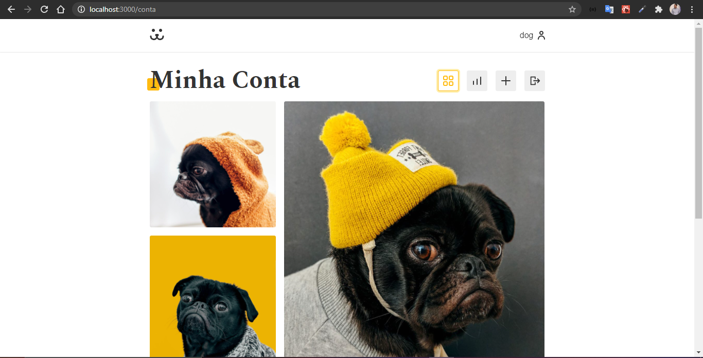

<h1>Projeto SocialDogs</h1>

<h2>Aplicação web de redes sociais para cachorros que conta com diversos recursos:</h2>

* Postagem e remoção de fotos;

* Postagem e remoção de comentários;

* Scroll infinito;

* Login com autenticação via json web token;

* REST API criada em Wordpress;

* Biblioteca externa para estatísticas de acessos;

* Validação de formulários e muito mais.

<h2>Página Inicial</h2>

<h2>Painel do Usuário</h2>

<h2>Postagem de Fotos</h2>

<h2>Estatísticas</h2>

Uso da biblioteca externa Victory para criar gráficos dinâmicos com a quantidade de acessos por imagem

